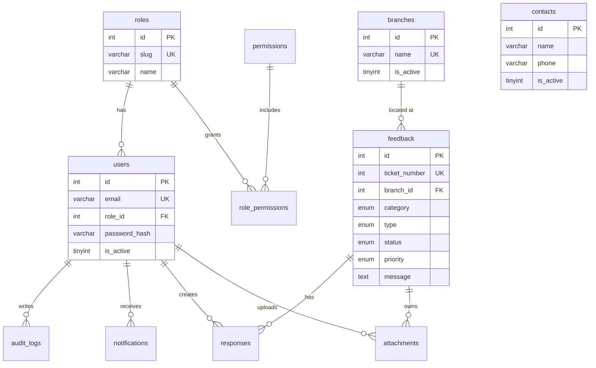

# ER Diagram

```mermaid
erDiagram
    roles ||--o{ users : has
    roles ||--o{ role_permissions : grants
    permissions ||--o{ role_permissions : includes
    users ||--o{ audit_logs : writes
    users ||--o{ notifications : receives
    users ||--o{ responses : creates
    feedback ||--o{ responses : has
    feedback ||--o{ attachments : owns
    users ||--o{ attachments : uploads
    branches ||--o{ feedback : "located at"

    roles {
      int id PK
      varchar slug UK
      varchar name
    }
    users {
      int id PK
      varchar email UK
      int role_id FK
      varchar password_hash
      tinyint is_active
    }
    branches {
      int id PK
      varchar name UK
      tinyint is_active
    }
    feedback {
      int id PK
      int ticket_number UK
      int branch_id FK
      enum category
      enum type
      enum status
      enum priority
      text message
    }
    contacts {
      int id PK
      varchar name
      varchar phone
      tinyint is_active
    }
```
