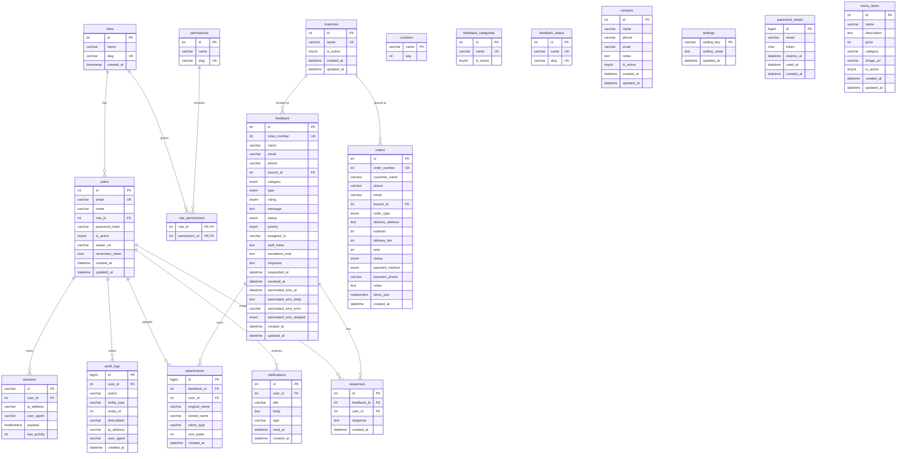

# ER Diagram

```mermaid
erDiagram
    roles ||--o{ users : has
    roles ||--o{ role_permissions : grants
    permissions ||--o{ role_permissions : includes
    users ||--o{ responses : creates
    users ||--o{ notifications : receives
    users ||--o{ audit_logs : writes
    users ||--o{ attachments : uploads
    users ||--o{ sessions : owns
    branches ||--o{ feedback : "located at"
    branches ||--o{ orders : "placed at"
    feedback ||--o{ responses : has
    feedback ||--o{ attachments : owns

    roles {
        int id PK
        varchar name
        varchar slug UK
        timestamp created_at
    }
    permissions {
        int id PK
        varchar name
        varchar slug UK
    }
    role_permissions {
        int role_id PK, FK
        int permission_id PK, FK
    }
    users {
        int id PK
        varchar email UK
        varchar name
        int role_id FK
        varchar password_hash
        tinyint is_active
        varchar avatar_url
        char remember_token
        datetime created_at
        datetime updated_at
    }
    counters {
        varchar name PK
        int seq
    }
    branches {
        int id PK
        varchar name UK
        tinyint is_active
        datetime created_at
        datetime updated_at
    }
    feedback {
        int id PK
        int ticket_number UK
        varchar name
        varchar email
        varchar phone
        int branch_id FK
        enum category
        enum type
        tinyint rating
        text message
        enum status
        enum priority
        varchar assigned_to
        text staff_notes
        text escalation_note
        text response
        datetime responded_at
        datetime resolved_at
        datetime automated_sms_at
        text automated_sms_body
        varchar automated_sms_error
        enum automated_sms_skipped
        datetime created_at
        datetime updated_at
    }
    feedback_categories {
        int id PK
        varchar name UK
        tinyint is_active
    }
    feedback_status {
        int id PK
        varchar name UK
        varchar slug UK
    }
    responses {
        int id PK
        int feedback_id FK
        int user_id FK
        text response
        datetime created_at
    }
    contacts {
        int id PK
        varchar name
        varchar phone
        varchar email
        text notes
        tinyint is_active
        datetime created_at
        datetime updated_at
    }
    notifications {
        int id PK
        int user_id FK
        varchar title
        text body
        varchar type
        datetime read_at
        datetime created_at
    }
    audit_logs {
        bigint id PK
        int user_id FK
        varchar action
        varchar entity_type
        int entity_id
        varchar description
        varchar ip_address
        varchar user_agent
        datetime created_at
    }
    settings {
        varchar setting_key PK
        text setting_value
        datetime updated_at
    }
    password_resets {
        bigint id PK
        varchar email
        char token
        datetime expires_at
        datetime used_at
        datetime created_at
    }
    sessions {
        varchar id PK
        int user_id FK
        varchar ip_address
        varchar user_agent
        mediumtext payload
        int last_activity
    }
    attachments {
        bigint id PK
        int feedback_id FK
        int user_id FK
        varchar original_name
        varchar stored_name
        varchar mime_type
        int size_bytes
        datetime created_at
    }
    menu_items {
        int id PK
        varchar name
        text description
        int price
        varchar category
        varchar image_url
        tinyint is_active
        datetime created_at
        datetime updated_at
    }
    orders {
        int id PK
        int order_number UK
        varchar customer_name
        varchar phone
        varchar email
        int branch_id FK
        enum order_type
        text delivery_address
        int subtotal
        int delivery_fee
        int total
        enum status
        enum payment_method
        varchar payment_phone
        text notes
        mediumtext items_json
        datetime created_at
    }
```
